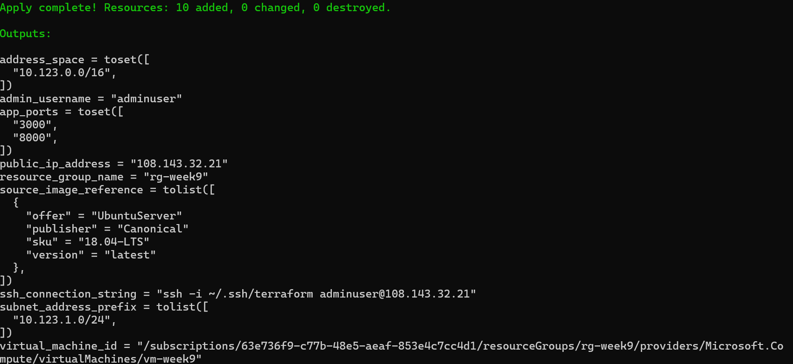
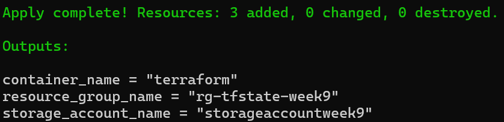
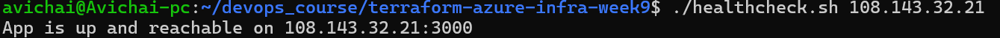
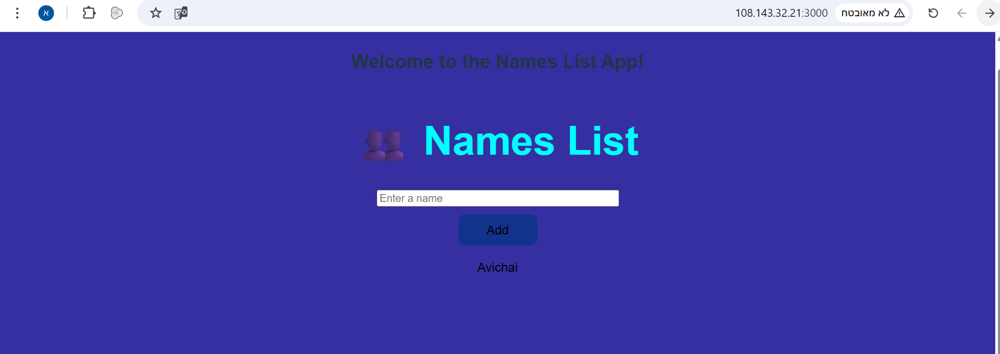

# Week 9 – Terraform Infrastructure on Azure: Full Project Summary

## Objective
This project demonstrates how to build a complete infrastructure on Microsoft Azure using Terraform, including networking, VM provisioning, remote state storage, and CI/CD automation.

---

## Project Structure
```text
project-root/
├── bootstrap/              # Remote state backend setup
│   ├── main.tf
│   ├── variables.tf
│   ├── outputs.tf
│   └── terraform.tfstate
├── main.tf                 # Root configuration with backend and module calls
├── variables.tf            # Global variables
├── outputs.tf              # Outputs
├── terraform.tfstate       # Remote state file
├── terraform.tfstate.backup
├── deployment.sh           # Deployment automation script
├── healthcheck.sh          # Healthcheck validation script
├── deployment_log.md       # Log file for Terraform commands
├── modules/
│   ├── resource_group/
│   │   ├── main.tf
│   │   ├── variables.tf
│   │   └── outputs.tf
│   ├── network/
│   │   ├── main.tf
│   │   ├── variables.tf
│   │   └── outputs.tf
│   └── virtual_machine/
│       ├── main.tf
│       ├── variables.tf
│       └── outputs.tf
├── import_vm/              # Directory for Terraform import practice
│   ├── main.tf
│   └── terraform.tfstate
└── app/                    # Web application folder
```

---

## Step-by-Step Workflow

### Step 1 – Project Initialization
- Created a new GitHub repository and cloned it locally.
- Initialized Terraform using:
```bash
terraform init
```

---

### Step 2 – Define Infrastructure Resources
- Provisioned:
  - Virtual Network (VNet)
  - Subnet
  - Network Security Group (NSG) with security rules
  - Public IP Address
  - Linux Virtual Machine (Ubuntu-based)
- Used `variables.tf` and `outputs.tf` for configuration flexibility.
- Used modules to structure the project.

### Screenshot – Terraform Apply (Main Project)


---

### Step 3 – Configure Remote State
- Created Azure Storage Account and container using a **bootstrap** project.
- Migrated local state to remote Azure storage backend.
- Configured the backend block in `main.tf`.

### Screenshot – Terraform Apply (Bootstrap)


---

### Step 4 – Apply Infrastructure
- Executed:
```bash
terraform apply
```
- Verified resource creation in Azure Portal.

---

### Step 5 – Healthcheck Script
- Created `healthcheck.sh` to validate the application is running.
- Used `curl` to verify the web service response.

### Screenshot – Healthcheck Execution


---

### Step 6 – Automatic Deployment (deployment.sh)
The `deployment.sh` script fully automates the deployment process:
- Generates an SSH key if not present.
- Initializes and applies Terraform configuration.
- Retrieves the VM’s public IP address from Terraform output.
- Connects to the VM using SSH.
- Installs Docker on the VM if missing.
- Transfers the application files to the VM.
- Runs the Docker Compose application on the VM.
- Configures swap memory for performance optimization.
- All Terraform commands and steps are logged to `deployment_log.md`.

### Explanation:
- This script **automates the entire provisioning and deployment** without manual intervention.
- The logging section ensures all output is saved for auditing.
- This improves reproducibility and minimizes human error.

---

### Step 7 – GitHub Actions – CI/CD Pipeline

A GitHub Actions workflow (`.github/workflows/terraform.yml`) was created to automate Terraform provisioning on push to the `main` branch.

```yaml
name: Terraform Apply

on:
  push:
    branches:
      - main

jobs:
  terraform:
    runs-on: ubuntu-latest

    steps:
    - name: Checkout Repository
      uses: actions/checkout@v3

    - name: Setup Terraform
      uses: hashicorp/setup-terraform@v2
      with:
        terraform_version: 1.5.7

    - name: Terraform Init
      run: terraform init

    - name: Terraform Plan
      run: terraform plan

    - name: Terraform Apply
      run: terraform apply -auto-approve
```

---

### Step 8 – Logging and Documentation
- Terraform command output is automatically logged in `deployment_log.md` using the deployment script.
- All project steps and structure are documented in this README.

---

### Step 9 – Resilience Test
- Rebooted the VM using Azure CLI:
```bash
az vm restart --resource-group rg-week9 --name vm-week9
```
- The application **did not automatically restart** initially.
- Solution: Added `--restart unless-stopped` to the Docker Compose command to ensure containers auto-start after reboot.

---

### Step 10 – User Experience and Validation
- Added a **custom welcome message** to the React application.
- Used environment variables to configure the welcome message.
- Verified application accessibility from multiple devices and browsers.

### Screenshot – Deployed Application


---

## Optional Stretch Goals Completed
- Used `terraform import` to bring an existing Azure VM under Terraform management (in the `import_vm` directory).
- Refactored Terraform code into separate modules.
- Setup a CI/CD pipeline using GitHub Actions for Terraform provisioning.
- Simulated basic auto-scaling by creating additional VMs using the existing modules.

---

## Summary
This project implements a full Azure infrastructure using Terraform best practices:
- Modular structure
- Remote backend storage
- Automated deployment and logging
- CI/CD integration
- Resilience testing
- Application validation across devices
